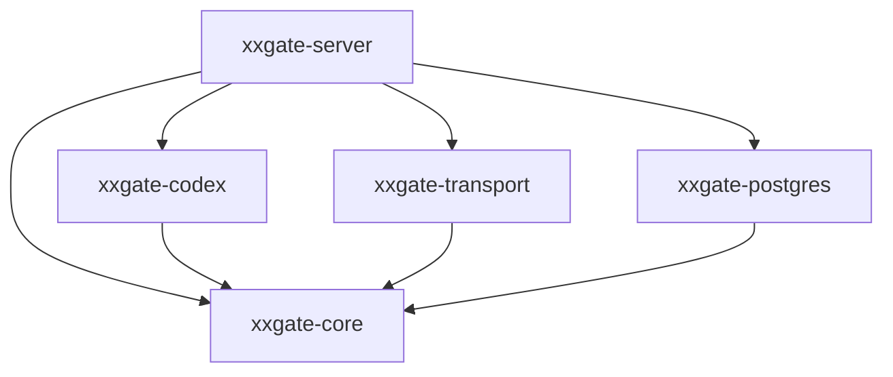
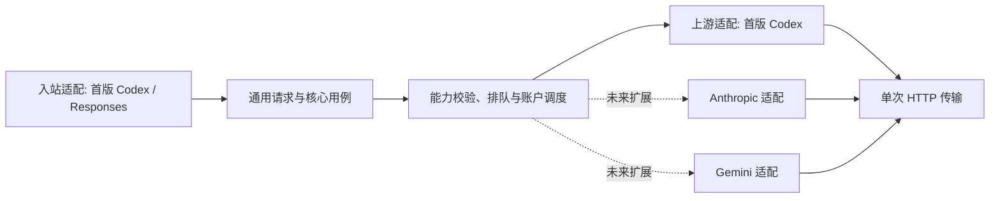

# XXGate 代码模块规划

状态：实现前的模块设计方案。本文规划目录、职责、依赖和约束，不表示这些代码已经存在。

行为基线见 [design.md](design.md)，统一术语见 [CONTEXT.md](../CONTEXT.md)。模块规划不改变已经确认的排队、迁移、单次调用、手动恢复和配置立即生效规则。尚未验证的协议能力继续保留为待验证项。

## 1. 总体组织

首版使用一个 Cargo workspace、五个 crate、一个服务进程。按实际依赖边界划分 crate，业务功能在核心 crate 内使用 Rust module 分隔，不把每个功能拆成独立服务。

| Crate | 职责 | 允许依赖的项目 crate |
|---|---|---|
| `xxgate-core` | 业务规则、用例编排、队列调度、身份映射、用量计价与热配置 | 无 |
| `xxgate-codex` | 分开的 Codex/Responses 入站适配与 Codex 上游适配，首版基线为 0.153.4 | `xxgate-core` |
| `xxgate-transport` | 单次 HTTP 调用、连接池、TLS、取消及传输阶段控制 | `xxgate-core` |
| `xxgate-postgres` | PostgreSQL 持久化、事务、查询、迁移脚本 | `xxgate-core` |
| `xxgate-server` | 程序装配、HTTP 路由、管理员接口、遥测初始化、后台任务生命周期 | 以上四个 |

`xxgate-core` 可以使用 Tokio、Bytes、HTTP 基础类型、序列化和必要的密码学依赖，但不依赖 Axum、Reqwest、SQLx，也不引入具体 Codex wire schema。核心分别定义 `IngressAdapter` 和 `ProviderAdapter`：前者处理调用方协议，后者处理上游服务。适配器可以保留自己的私有请求文档，但跨适配器交换使用核心的通用请求、事件及有来源约束的扩展，不通过全局服务容器或任意类型转换传递数据。



这是编译依赖图。运行时核心用例通过明确端口调用入站协议、上游提供方、传输和存储实现；实现由 `server` 注入。三个适配 crate 不直接互相调用。

首版仍只有五个 crate。未来需要时增加 `xxgate-anthropic`、`xxgate-gemini` 等提供方 crate，依赖核心端口；新增上游不要求依赖 `xxgate-codex`。当前只明确扩展契约，不创建这些 crate 或空实现。扩展规则详见第 12 节。

## 2. 计划目录

以下是未来目录，不在本轮创建源码或 Cargo 配置：

```text
xxgate/
  CONTEXT.md
  docs/
    design.md
    modules.md
  crates/
    xxgate-core/src/
      lib.rs
      types.rs
      application/
        gateway.rs
        account_commands.rs
        settings_commands.rs
        maintenance.rs
        finalize.rs
        ports.rs
      access/
      accounts/
      protocol/
      providers/
      scheduling/
      identity/
      quota/
      usage/
      pricing/
      settings/
      audit/
      reports/
    xxgate-codex/src/
      lib.rs
      baseline.rs
      wire/
        identity.rs
        responses.rs
        sse.rs
      ingress/
        identity.rs
        request.rs
        response.rs
        errors.rs
        heartbeat.rs
      provider/
        request.rs
        events.rs
        references.rs
        images.rs
        usage.rs
        errors.rs
        oauth/
        quota/
        profile/
    xxgate-transport/src/
      lib.rs
      client_pool.rs
      tls.rs
      request.rs
      deadlines.rs
      stream.rs
    xxgate-postgres/
      src/
        lib.rs
        accounts.rs
        access.rs
        bindings.rs
        requests.rs
        usage.rs
        pricing.rs
        quota.rs
        settings.rs
        audit.rs
        reports.rs
        transactions.rs
      migrations/
    xxgate-server/src/
      main.rs
      bootstrap.rs
      state.rs
      shutdown.rs
      http/
        public/
        admin/
        middleware/
      workers/
      telemetry/
  web/
    src/
      features/
        dashboard/
        accounts/
        requests/
        usage/
        models/
        keys/
        settings/
        audit/
      shared/
  tests/
    contracts/
    scenarios/
    fixtures/
```

前端框架尚未选择，`web` 只定义管理员功能边界；未来编译产物可由同一服务提供。辅助接口是否支持继续遵循设计基线中的待定范围。

## 3. 核心业务模块

| 模块 | 自己负责 | 不应承担 |
|---|---|---|
| `application` | 请求全生命周期；账户命令、配置命令和维护任务的跨模块编排 | 堆积 JSON 字段转换、SQL 或路由细节 |
| `access` | 管理员凭证与会话、网关 Key 签发/校验/撤销及命名空间 | 终端用户系统；上游 OAuth |
| `accounts` | 提供方与接入方式、账户启用开关、停用原因、客户端配置和凭证生命周期；首版 OAuth 互斥刷新 | 公平队列、HTTP 路由、自动恢复账户 |
| `protocol` | 通用请求与事件、入站身份语义、入站适配端口和扩展数据的来源约束 | Codex/Claude/Gemini 具体 JSON 字段及无损转换保证 |
| `providers` | 上游适配端口、提供方及模型目录、能力匹配、模型路由约束 | 具体上游 HTTP 调用；根据模型字符串猜厂商 |
| `scheduling` | 排队、公平性、容量、派发许可、账户运行资格与迁移时序 | 正文解析、身份字段重写、模型 HTTP 调用 |
| `identity` | 客户端身份、绑定代次、稳定映射、父子/配对关系和迁移前置条件 | 根据负载自主选账户；解释具体 JSON 路径 |
| `quota` | 官方额度快照、有效性和耗尽判定 | 人民币计价；直接打开账户开关 |
| `usage` | 用量事实、来源、完整性及终态去重 | 推断官方额度；应用模型单价 |
| `pricing` | 人民币价格版本、按提供方/模型/服务档位的分项计算；首版 Standard/Fast 规则 | 修改 Token 事实；用户钱包 |
| `settings` | 配置校验、版本、变更分类、发布及生效确认 | 保存后只更新新请求；自行修改账户绑定 |
| `audit` | 可持久化的脱敏请求事件、管理员事件和状态变更记录 | 保存完整请求或响应；替代指标系统 |
| `reports` | 管理员查询条件、统计口径和面向界面的查询结果 | 在查询时修改计量流水或运行状态 |

`types.rs` 只放跨模块确实共享的标识类型和少量基础值类型，不设不断扩张的 `common`、`utils` 或 `managers` 目录。模块内的 `error.rs`、`ports.rs`、`model.rs` 按实际需要创建，不为空架构预建空文件。

### 核心模块的依赖规则

- `application` 是跨模块用例的入口；HTTP handler 和后台任务调用用例，不自行拼装数据库修改和调度动作。
- `protocol` 定义共同内容及入站端口，`providers` 使用这些契约声明上游能力和端口；协议类型不反向依赖提供方实现。
- 入站解析、模型解析和能力校验先于排队；调度器接收已明确的提供方与兼容候选范围，出队时复核账户权限或能力版本变化。
- `scheduling` 使用 `accounts` 的资格快照和 `identity` 的绑定规则；`accounts`、`identity` 不反向调用调度器。
- `quota` 产出带来源的额度事实或耗尽证据，由账户命令用例决定关闭开关并同步调度。
- `usage` 产出用量事实，`pricing` 对事实计价；两者均不依赖 `reports`。
- `audit` 定义允许留存的事件类型，模块通过窄接口提交；遥测初始化在 `server`，不形成业务模块循环依赖。
- 配置变更经 `application::settings_commands` 协调各运行组件，`settings` 不直接持有所有业务服务。

同一 crate 内通过私有字段、受限模块可见性和少量明确的公开用例维持边界，不把所有内部类型标为 `pub`。接口按实际调用需要定义，不为每个结构体机械增加 trait。

## 4. 调度、身份与请求的所有权

### 单一调度写入口

`scheduling::coordinator` 作为单机调度状态的唯一写入口，串行处理资格变化、队列变更、并发占用、绑定迁移和派发命令。协议转换、TLS、数据库查询和正文读写不在该入口中做长时间阻塞。

数据持久化可以异步执行，调度器将相应会话置于内部的“等待提交”状态，提交完成后按版本确认结果；这不是新增对外账户状态。不得因等待某个账户的数据库操作阻塞整个账户池。

`accounts` 拥有业务上的启用状态，`identity` 拥有绑定与映射规则，`scheduling` 拥有运行时调度顺序和并发计数。三者可以持有只读快照，但不能分别维护可独立变更的绑定表或并发计数。

### 请求与许可

| 对象 | 所有者 | 生命周期约束 |
|---|---|---|
| `RequestContext` | `application::gateway` | 保存网关请求标识、原入队时间、取消与配置影响信息 |
| 内存中的请求文档 | 当前请求任务 | 正文不进入数据库或审计；预算覆盖排队和必要的处理缓冲 |
| `QueueTicket` | 调度器登记，请求任务持有取消入口 | 客户端断开或到期即可撤销，迁移不重置等待起点 |
| `DispatchLease` | 调度器发出，请求任务持有 | 固定账户、绑定代次和并发占用，不能克隆出第二次调用权限 |
| `IdentityMappingPlan` | `identity` 生成，协议适配器应用 | 包含有类型的替换及关联关系，不携带完整提示词 |
| 一次发送授权 | `scheduling` 与传输端口衔接 | 发送开始与账户停用有明确顺序，只能消费一次 |
| `RequestOutcome` | `application::finalize` | 汇总执行、用量完整性和取消/错误原因，幂等落库 |

`DispatchLease` 处于准备阶段时仍可因账户停用失效。最终开始发送前再次校验，尚未发送的请求可以回到调度流程，沿用原入队时间；一旦发送授权已消费，任何失败都不得重新发送。

开始发送与停用在同一调度顺序下确定：先开始发送的请求视为在途并允许收尾，先停用的账户不会获得新的发送授权。会话迁移必须等待旧代次的全部在途许可释放。

许可释放、取消与最终记录都需要幂等防护；释放通知不能依赖一个可能静默丢失的非阻塞消息。并发上限降低时继续统计已有许可，不通过替换一个新的 semaphore 让旧占用消失。

## 5. Codex 入站与上游适配

`xxgate-codex` 是首版解释 Codex wire 字段的位置，内部明确分为 `ingress`、`provider` 和共享的纯编解码模块 `wire`。`ingress` 与 `provider` 各自实现核心定义的端口，可以复用 `wire`，不能互相调用或隐式假定对方一定是 Codex。

| 子模块 | 职责 |
|---|---|
| `baseline` | 固定 Codex tag/commit、兼容版本和字段能力说明 |
| `wire` | Codex/Responses 字段结构、SSE 帧解码/编码及跨网络 chunk 缓冲，不包含业务调度 |
| `ingress::identity` | 入站多个身份投影的提取、冲突检查，转为核心客户端会话和线程身份 |
| `ingress::request` | 入站参数校验，生成通用请求及有来源标记的扩展 |
| `ingress::response` | 将通用增量/终态事件编码为调用方 Responses 格式，并关联客户端可见 ID |
| `ingress::errors` / `heartbeat` | 编码调用方能够理解的错误和排队心跳，不假定上游事件格式 |
| `provider::request` | 根据通用请求、账户配置和映射计划构造 Codex 上游允许列表请求 |
| `provider::events` | 解码官方 SSE 为通用事件及受限扩展，保留上游对象及其引用 ID |
| `provider::references` | 正文对象及关联 ID 透传，旧客户端别名还原；官方对象引用能力判定；不保存内容摘要 |
| `provider::images` | 图片输入/生成/编辑字段与引用检查，不创建额外模型调用 |
| `provider::usage` | 提取并归一化上游用量，保留原始 usage 的可留存计量字段 |
| `provider::errors` | 上游 HTTP/SSE 错误分类，区分授权失效、额度耗尽和普通故障 |
| `provider::oauth` | 授权及刷新请求/响应格式，返回凭证结果；不负责账户开关 |
| `provider::quota` | 额度查询请求与响应头/正文的字段解释 |
| `provider::profile` | 基于账户配置构造一致的客户端头和协议元数据 |

协议适配器不持有数据库连接、账户池或 Reqwest client。它通过核心端口返回待发送的请求描述和上游观测结果，由用例编排交给传输或业务模块。

客户端会话元数据映射采用“枚举有类型的引用 -> 获取该代次的映射 -> 应用到协议投影”的流程。映射的唯一性与持久性属于核心 `identity`；入站和上游字段位置分别属于对应适配器。正文对象 ID 随内容透传，SSE 增量事件与最终对象保持相同的原始 ID。旧客户端对象别名仅在同一 Key、会话和提供方范围内兼容还原，不产生新的正文 ID 映射。

图片大事件与未知扩展字段需要有界缓冲和明确的支持策略。不能按 TCP chunk 直接解析 JSON，也不能递归替换所有名为 `id` 的字段或扫描提示词中的字符串进行替换。

## 6. HTTP 传输边界

`xxgate-transport` 接受已经确定目标、认证上下文、请求头和正文的请求，执行一次 HTTP 调用并返回状态、响应头及字节流。

- 模型调用入口只暴露单次发送语义，禁用会重放模型请求的重试和回退路径。
- OAuth、额度查询属于明确区分的控制请求，不计入“上游模型尝试”，不会使失败的模型请求重新执行。
- 连接池按照提供方、接入方式、目标地址、账户客户端配置及连接相关版本复用，不能让不同账户或提供方的认证状态、Cookie 意外共享。
- 传输阶段报告使用核心定义的阶段事件，连接建立、收到响应头及流结束分别记录。
- 正在进行的连接和字节读取必须能被取消或新的超时规则打断。
- 服务端账户调度、Codex 字段解释、usage 计价和数据库写入都不在传输模块内。

连接超时热更新不能只重建 Reqwest client；新 client 不会改变已经开始的连接。需要验证 0.153.4 所用传输路径提供的连接阶段观测与取消边界，再实现外部可更新的 deadline 控制，不能把“收到响应头前的总等待”直接冒充“连接超时”。此项保留为技术验证任务。

上游 SSE 空闲超时由请求监督器依据协议解码后的有效上游事件更新。网关排队心跳是下游事件，不能延长上游空闲期限。

Codex 0.153.4 的库版本、TLS 行为和客户端头约束只作为 Codex 出站配置的基线。未来提供方可使用独立的传输配置；确有必要时通过同一单次发送端口装配其他传输实现，不迫使所有提供方使用 Codex 特征。

## 7. 持久化、事务与查询

`xxgate-postgres` 拥有 SQLx、SQL、schema 与 migration。核心模块定义自己需要的读写端口，避免向所有模块注入同一个可任意执行 SQL 的 pool。

| 数据类别 | 业务归属 | 存储特点 |
|---|---|---|
| 账户、加密凭证、客户端配置 | `accounts` | 带提供方、接入方式、凭证类型；版本化更新且凭证读取范围受限 |
| 模型目录与能力信息 | `providers` | 模型由提供方与接入方式共同限定，不把裸模型名当作全局唯一键 |
| 管理员凭证、会话、网关 Key | `access` | 网关 Key 保存验证材料，避免保存可直接使用的完整 Key |
| 会话绑定、代次、ID 映射 | `identity` | 记录提供方和兼容接入范围；唯一约束、条件更新及历史可追踪 |
| 请求与派发记录 | `application` / `audit` | 派发前建立记录，终态可幂等更新 |
| 用量事实与计价明细 | `usage` / `pricing` | 按提供方、调用及计量项防重复，事实与价格版本分别关联 |
| 额度快照 | `quota` | 按额度池、作用范围和窗口保存；保留时间、来源、单位及有效性 |
| 运行配置版本 | `settings` | 保存、发布及管理员变更记录关联 |
| 请求事件、管理员审计 | `audit` | 只接收明确允许留存的类型 |
| 管理员报表结果与聚合 | `reports` | 允许只读跨表查询，不反向修改业务事实 |

跨模块事务由实际用例定义窄的提交接口，SQLx Transaction 不跨入核心 crate，也不引入任意回调式的通用 Unit of Work 框架。例如：

- 关闭账户开关与写入管理员/自动停用审计。
- 提交绑定新代次、建立身份命名空间与记录迁移事件。
- 保存配置新版本与记录配置修改。
- 幂等提交请求终态、用量事实、计价结果及终态审计。

数据库提交与内存状态不能假装处于同一个原子事务。账户停用先阻止新的派发，提交持久化变更后再确认；确认回滚后才恢复旧状态并报告失败。提交结果不明时，先核对持久化版本，受影响账户或会话暂不获得新发送授权。绑定提交期间保留调度预约，成功后发布新代次，失败时不允许携带未确认映射发往上游。

调度与业务状态变化使用有结果确认的命令，不依靠可能丢消息的遥测或通用事件总线驱动。指标可以异步采样，关键审计不能以相同方式静默丢弃。

进程异常退出后对没有终态的请求标记中断或结果未知，不补发。对于上游已执行但最终 usage 来不及持久化的窗口，不能保证精确补回用量；审计必须呈现这种不完整性。

## 8. 配置热更新的模块协作

```text
管理员 API
    → settings_commands 校验变更
    → PostgreSQL 保存配置版本与审计
    → 发布运行配置版本并唤醒相关控制器
    → 调度、请求监督器、心跳与清理任务应用新策略
    → 生效确认后返回保存成功
```

`settings` 提供不可变版本快照和变更通知；`scheduling`、在途请求监督器及后台任务各自拥有需要更新的计时器与控制状态。变更必须唤醒已有等待，不允许只在下一条新请求到来时读取新配置。

| 消费组件 | 负责立即调整的内容 |
|---|---|
| `scheduling` | 排队期限、队列准入、公平调度参数与并发上限 |
| 请求监督器 / `transport::deadlines` | 在途连接和上游事件空闲期限 |
| 请求监督器 / SSE 输出 | 排队心跳间隔 |
| `application::maintenance` | 数据保留策略、清理触发及进度 |
| `audit` | 修改记录、配置版本及受影响请求的关联 |

期限始终按原入队、原连接开始或最近有效上游事件计算，不在修改配置时重置计时。已到新期限的请求立即结束，提高的并发或队列容量即时可用，降低的资源上限阻止新增占用而不强制抛弃存量。

持久化成功但发布未完成的异常必须报告实际配置状态，不能返回含糊的成功。进程启动时从已持久化的最新有效版本恢复。热更新不改变已经派发请求的账户、身份代次或既有历史计价。

## 9. 服务入口、后台任务与管理员界面

`xxgate-server` 的 HTTP handler 只完成鉴权上下文提取、请求大小限制、选择入站适配器、调用核心用例及输出响应。SSE 编码由入站适配器提供，首版使用 `xxgate-codex::ingress`；handler 不自建第二套错误协议或重试逻辑。

管理员路由按账户、Key、模型价格、用量、请求、配置和审计分类，统一调用核心命令/查询。管理员登录与模型请求 Key 鉴权使用独立入口和凭证类型。

后台任务只包括已需要的凭证维护、额度采集、统计聚合、保留期清理与异常终态整理。任务生命周期由服务统一启动、取消和等待，任务业务规则在 `application::maintenance`；不增加自动启用账户或模型请求补发任务。

前端 `features` 与这些管理员领域对应。前端可以计算展示格式，不能复制账户迁移、Fast 金额或配置生效判定规则。接口 DTO 与业务类型分离，避免直接把数据库行或含凭证的结构返回浏览器。

遥测初始化、导出和指标注册放在 `server::telemetry`。业务模块使用结构化 span 和事件，不依赖具体监控产品。完整业务审计与采样遥测各自有明确存储路径。

## 10. 测试与边界检查规划

本轮不编写测试；以下是实现时的验证归属：

| 范围 | 重点 |
|---|---|
| `core::scheduling` | 可控时钟下的公平性、等待取消、容量降低、停用与派发竞争 |
| `core::identity` | A -> B -> A 换代、同代次稳定性、父子引用、并发首次绑定 |
| `core::accounts` / `quota` | 关闭开关的证据分类、仅管理员恢复、额度更新不自动启用 |
| `core::usage` / `pricing` | 缺失用量、包含关系、重复终态、Fast 未确认与价格版本 |
| `core::protocol` / `providers` | 同名模型的提供方隔离、能力不支持的明确拒绝、不可跨提供方透传专有状态 |
| `xxgate-codex` | 入站与上游适配独立验证；固定版本的合成请求/SSE fixture、分片与合帧、ID 双向关联、大图片事件 |
| `xxgate-transport` | 本地模拟上游验证单次发送、取消、连接阶段与超时热更新 |
| `xxgate-postgres` | 实际 PostgreSQL 事务、唯一约束、竞争提交和迁移脚本 |
| `tests/scenarios` | 排队中停用、跨代次屏障、配置生效确认、终态持久化失败与重启 |
| 管理员界面 | 保存后版本生效、停用原因、排队/迁移时间线与清理进度 |

fixture 使用合成数据，不收集真实提示词、图片或 OAuth 凭证。大多数验证通过本地模拟上游完成；Codex 直连、真实 OAuth 图片能力和加密上下文迁移另做明确范围的集成验证。

CI 检查 workspace 依赖方向、格式与静态检查，并运行对应边界的测试。禁止核心 crate 引入 Axum/Reqwest/SQLx、三个适配 crate 互相依赖，或测试辅助代码成为生产模块依赖。

## 11. 实现顺序与范围约束

未来开始实现后，建议按可验证流程推进，每阶段同时接入必要审计，而不是最后补观测：

1. 建立五 crate 的依赖边界、独立入站/上游端口、配置版本、管理员/Key 基础和元数据持久化。
2. 使用模拟上游打通单账户、单次 HTTP/SSE、取消、错误及用量记录。
3. 增加队列、公平性、并发上限和已有请求的配置热更新。
4. 增加持久化身份映射、绑定代次、停用迁移及双向协议 ID 处理。
5. 接入真实 OAuth、额度采集、模型价格及图片能力，完成对应兼容性验证。
6. 完成管理员观测视图、保留期清理与单机规模验证。

阶段先后不是能力承诺。未经验证的图片或加密状态迁移不能通过简化 ID 处理宣称支持；不为统一接口额外实现 WebSocket、通用模型请求重试、多实例分布式锁或终端用户管理。Responses 的加密推理恢复例外由提供方识别和清理、核心用例消费受限补发许可。

## 12. 未来提供方扩展

本节是已确定的扩展边界，首版仍只实现 Codex 0.153.4 入站身份与 Codex HTTP/SSE 上游。Claude、Gemini 的具体接口、OAuth 托管和能力支持不在首版实现范围内。

### 入站协议与上游提供方独立



上游响应沿反向流程经过提供方解码、核心计量与身份关联、入站适配器编码后返回客户端。排队心跳和最终错误的对外格式由入站协议决定，不由上游提供方决定。

- `IngressAdapter`：解析客户端请求和身份，声明客户端能够表达的能力，编码响应、心跳与错误。
- `ProviderAdapter`：声明上游能力与凭证支持，构造请求，解释上游事件、引用、用量、额度和错误。
- `application`：组合两种适配器，共用队列、绑定、单次调用、计价、审计与热配置。

将来新增 Claude 或 Gemini 上游时，新增对应的提供方 crate 并在服务启动时注册。需要原生入站协议时，再增加该协议的入站适配。采用显式装配，暂不设计动态加载插件、任意用户脚本或全协议自动转换框架。

### 共同内容与专有状态

核心只统一可明确表达的消息内容、工具调用及结果、图片引用、生成选项、用量和执行事件。不以 Codex 请求结构或 Responses 事件名作为所有提供方的内部模型。

适配器保留有来源标记和边界限制的专有扩展，用于同一兼容接入范围内传回提供方。扩展记录所属提供方、接入方式、格式版本，以及适用的账户/绑定代次约束。新提供方不能直接读取或转发旧提供方的加密上下文、签名或服务端对象引用。

同提供方流程需要验证通用表示及扩展没有丢失协议语义；跨提供方流程仅支持明确实现的转换范围。转换不支持时返回具体能力或上下文错误，不静默删除字段，不将未知签名改成随机 ID。

Claude 的内容块流式事件和累计 usage、Gemini 的 thought signature 是需要专门适配的例子，不能等同于更换模型名和 URL。[Claude 流式协议](https://platform.claude.com/docs/en/build-with-claude/streaming)、[Gemini thought signatures](https://ai.google.dev/gemini-api/docs/generate-content/thought-signatures)

专有扩展可能包含内容和签名，仅在请求处理期间保留；不能因为属于扩展就进入“仅保存元数据”的审计。原始 usage 也只保留明确允许留存的计量字段，不保存整个上游事件正文。

### 账户、模型与迁移范围

通用账户模型预留 `provider_id`、`access_kind`、`credential_kind`。订阅账户通道、官方 API 等接入方式分别声明授权与能力，凭证类型不统一假定为 OAuth；首版只实现已要求的 ChatGPT OAuth 流程。

模型内部标识由提供方、接入方式和上游模型 ID 共同确定。对外名称或别名通过明确的模型目录解析，不根据名称前缀猜测提供方。记录客户端请求模型与上游实际模型，价格和统计沿同一提供方范围关联。

客户端会话首次绑定时确定提供方及兼容接入范围。账户停用后的自动迁移只在该范围内进行，并继续建立新的绑定代次；不能借账户迁移自动把 Codex 对话切到 Claude 或 Gemini。同一会话显式跨厂商切换属于未来单独的上下文转换能力，首版不支持。

### 能力、计量与额度

能力声明至少区分文本、图片输入、图片生成、图片编辑、工具调用、推理选项、结构化输出、服务档位及上下文引用能力。实际支持范围由提供方、模型、接入方式和账户权限共同决定，不能仅使用一组对所有模型生效的布尔开关。

入队前校验入站表达能力与候选上游能力的交集。不支持与暂时缺乏容量分别处理：不支持明确拒绝，暂时满载继续按既定规则排队；出队时复核更新后的资格与能力。

用量归一化保留提供方原始口径及转换版本，区分累计值、增量值、总量和子集，避免把每次流事件的累计用量重复相加。缓存读写、推理、图片和工具等计量项按提供方语义转换，价格按提供方、模型和实际服务档位匹配。Fast 不假定是所有厂商通用的倍数或参数值。

额度按额度池、作用范围、窗口、单位和数据来源表示，不把 `5h` 与 `7days` 固化成通用账户字段。首版 Codex 界面展示这两个窗口；不提供某种额度信息的接入方式显示不支持或未知，不显示虚假的零额度，也不因普通速率限制自动认定订阅额度耗尽。

### 新增提供方的完成条件

未来每次接入需完成能力声明、认证、请求与流式响应转换、身份/引用规则、用量与错误分类，以及对应的合成 fixture 和集成验证。账户池、队列、公平性、开关、配置版本和审计流程应直接复用，提供方模块不得创建自己的第二套调度系统。

官方 API 接入可用不代表订阅账户 OAuth 托管可用，也不代表跨账户或跨厂商上下文可迁移。实际接入时分别确定支持范围，并继续遵守默认一次、仅显式加密推理恢复最多两次的调用约束；协议转换本身不能额外发起模型调用补齐语义。
